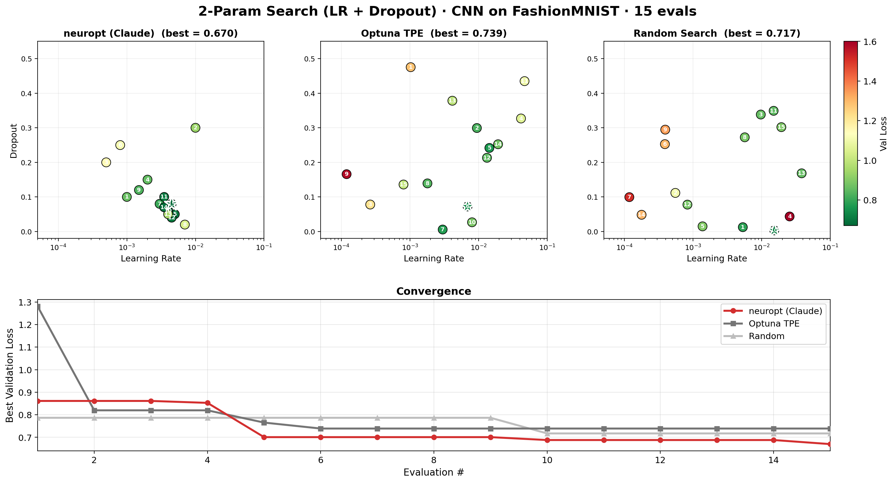

# neuropt

<p align="center">
  
</p>

<p align="center">
  <em>An LLM reads your training curves and designs your next experiment.</em>
</p>

---

<p align="center">
  <a href="https://loevlie.github.io/neuropt/quickstart/"><strong>Get started with neuropt →</strong></a>
</p>

Point it at a training script, let it run overnight. The LLM sees full per-epoch train/val curves, spots overfitting, and proposes what to try next — like a research assistant who never sleeps and actually reads the loss plots.

### vs Optuna and random search

<p align="center">
  
</p>

Same 15-eval budget on two tasks: CNN architecture search (14 params) and XGBoost tuning (9 params, 7-class Covertype). These results use **Claude Haiku 4.5** (the smallest and cheapest of their 4.5 models). We expect even stronger results with Sonnet or Opus. Optuna's TPE was configured with `n_startup_trials=3` for a fair comparison (default is 10, which would make it purely random for most of the budget).

In a separate 200-eval run on the CNN task, neuropt again beat the others within 15 evals and kept improving — reaching 0.337 val loss by eval 200 (vs 0.454 for Optuna's best at 15). Local Qwen backend (experimental) also beat Optuna at 15 evals (0.440 vs 0.454) despite a 40% JSON parse failure rate.

<p align="center">
  
</p>

## Quick start

```bash
pip install "neuropt[llm]"
export ANTHROPIC_API_KEY="sk-ant-..."
```

**Option 1** — define what to search over:

```python
# train.py
search_space = {
    "lr": (1e-4, 1e-1),                    # auto-detects log-scale
    "hidden_dim": (32, 512),                # auto-detects integer
    "activation": ["relu", "gelu", "silu"], # categorical
}

def train_fn(config):
    model = build_my_model(config["hidden_dim"], config["activation"])
    # ... train, return per-epoch losses for smarter LLM decisions ...
    return {"score": val_loss, "train_losses": [...], "val_losses": [...]}
```

**Option 2** — just give it a model, we figure out the rest:

```python
# train.py
model = torchvision.models.resnet18(num_classes=10)  # neuropt introspects this

def train_fn(config):
    m = config["model"].to("cuda")  # deep copy with modifications applied
    # ... train ...
    return {"score": val_loss, "train_losses": [...], "val_losses": [...]}
```

Then run:

```bash
neuropt run train.py
```

Runs until Ctrl+C. Crash-safe, resumable. Works in notebooks too:

```python
from neuropt import ArchSearch

search = ArchSearch(train_fn=train_fn, search_space=search_space, backend="claude")
search.run(max_evals=50)
```

## Documentation

See the [full documentation](https://loevlie.github.io/neuropt/) for:

- [How it works](https://loevlie.github.io/neuropt/how-it-works/) — what the LLM sees, training curve analysis
- [CLI reference](https://loevlie.github.io/neuropt/cli/) — `neuropt run`, `inspect`, `results`
- [Python API](https://loevlie.github.io/neuropt/api/) — `ArchSearch`, `from_model`, search space types
- [Model Introspection](https://loevlie.github.io/neuropt/introspection/) — `from_model()` auto-detection, activations, dropout, pooling
- [Fine-Tuning](https://loevlie.github.io/neuropt/fine-tuning/) — pretrained models, freeze strategies, L2-SP
- [Examples](https://loevlie.github.io/neuropt/examples/) — CNN search, ResNet tuning
- [Benchmarks](https://loevlie.github.io/neuropt/benchmarks/) — vs Optuna, random search

## Installation

```bash
pip install neuropt                  # core
pip install "neuropt[llm]"           # + Claude API (recommended)
pip install "neuropt[llm-openai]"    # + OpenAI API
pip install "neuropt[all]"           # everything
```

## License

MIT
