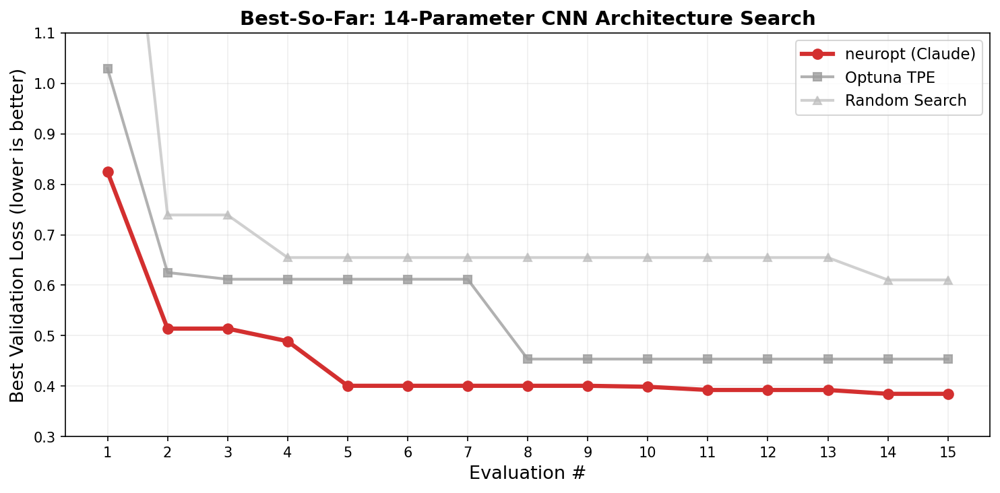

# Benchmarks

## 15-eval benchmark (14-parameter CNN search)

All methods get exactly 15 evaluations on the same search space. FashionMNIST, 5 epochs per eval, M1 MacBook.



| Method | Best Loss | Best Acc | LLM Fallbacks |
|--------|-----------|----------|---------------|
| **LLM (Claude)** | **0.385** | **85.4%** | 0/5 |
| Optuna TPE | 0.454 | 82.7% | — |
| Random Search | 0.610 | 76.7% | — |
| LLM (Qwen local) | 0.637 | 75.0% | 2/5 |

### Convergence

| Eval | LLM (Claude) | Optuna TPE | Random | LLM (Qwen) |
|------|-------------|------------|--------|-------------|
| 5 | **0.401** | 0.612 | 0.655 | 0.748 |
| 10 | **0.399** | 0.454 | 0.655 | 0.637 |
| 15 | **0.385** | 0.454 | 0.610 | 0.637 |

Claude was ahead of Optuna from eval 5 onward — it started with good architectural priors (residual connections, AdamW, reasonable LR) instead of discovering them through trial and error.

All benchmark results used **Claude Haiku 4.5** (the smallest, cheapest Claude model at ~$0.01/run). We expect stronger results with Sonnet or Opus, which have better reasoning capabilities for complex search spaces.

### What went wrong with the other methods

**Optuna TPE** — 7 out of 15 evals scored above 1.0 (worse than random chance). With 14 parameters, TPE's surrogate model needs many more samples before it becomes useful. It found one good config at eval 8 but couldn't build on it.

**Random search** — Actually outperformed Qwen, which says more about Qwen's parse failures than random's quality. Random got lucky with a few configs but has no mechanism to improve.

**LLM (Qwen local)** — Failed to produce valid JSON on 2 of 5 iterations (40% fallback rate). When it did generate configs, they were reasonable but not as focused as Claude's. The local Qwen backend is experimental — it works for simpler search spaces but struggles with 14-key JSON output.

### Why Claude wins on this search space

With 14 parameters including categorical choices (activation, optimizer, pool type, residual on/off), the search space has complex interactions:

- High LR + no batch norm = training instability
- Deep networks + no residual = vanishing gradients
- Dropout + small dataset subset = unnecessary regularization

Claude starts with knowledge of these interactions. Optuna has to discover each one empirically, burning evals on configurations that any ML practitioner would avoid.

### Run it yourself

```bash
pip install swarmopt[llm]
export ANTHROPIC_API_KEY="sk-ant-..."

python examples/benchmark.py
python examples/benchmark.py --n-evals 30          # longer run
python examples/benchmark.py --skip-qwen           # skip local model
python examples/benchmark.py --skip-qwen --n-evals 50  # thorough comparison
```
